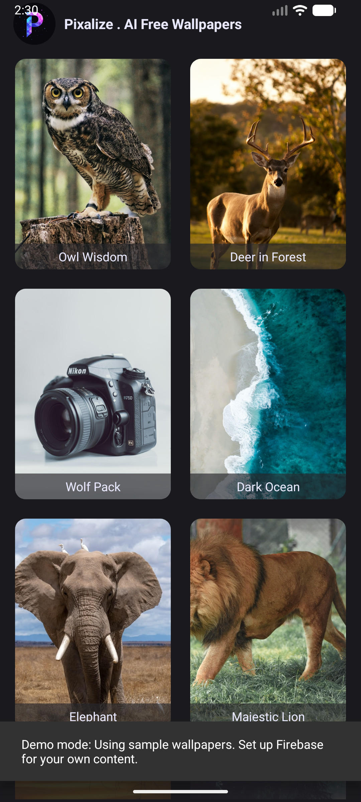
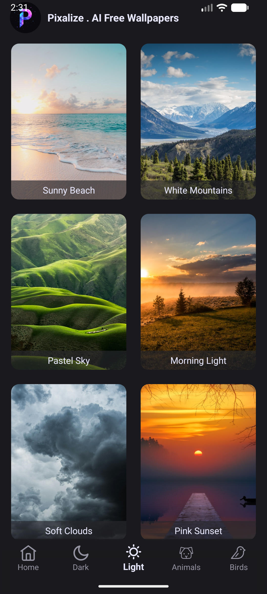
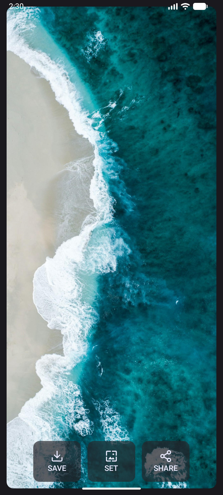
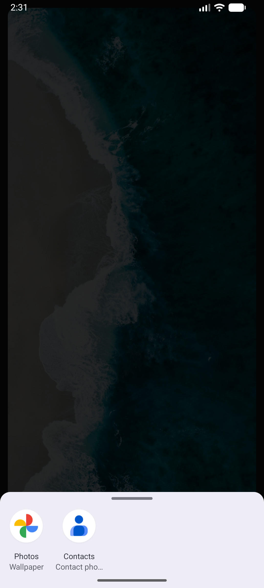
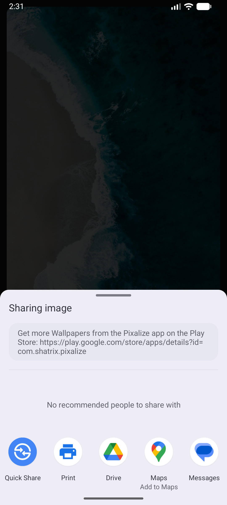

# Pixalize - AI Wallpapers

<p align="center">
  
</p>

<p align="center">
  <b>A beautiful Android wallpapers app with AI-generated images</b>
</p>

<p align="center">
  
  
  
  
</p>

---

## ✨ Features

- 🎨 **AI-Generated Wallpapers** - Curated collection of stunning AI-created images
- 📁 **Category Browsing** - Browse by Dark, Light, Animals, Birds, or All
- ⬇️ **Download** - Save wallpapers directly to your gallery
- 🖼️ **Set as Wallpaper** - Apply wallpapers with one tap
- 📤 **Share** - Share your favorite wallpapers with friends
- 🔄 **Pull-to-Refresh** - Always see fresh content
- 🌑 **Dark Theme** - Beautiful dark UI
- ⚡ **Optimized Loading** - Glide with placeholder and thumbnail preloading
- 🎯 **Demo Mode** - Works immediately! Includes sample wallpapers from Unsplash


---

## 📱 Screenshots

<p align="center">
  
  
  
</p>

<p align="center">
  
  
</p>

| Screen | Description |
|--------|-------------|
| **Home** | Main gallery with wallpaper grid and category navigation |
| **Light Wallpapers** | Browsing the Light category |
| **Detail View** | Full-size wallpaper with Download, Set, Share buttons |
| **Set Wallpaper** | System wallpaper picker |
| **Share** | Share menu for sending wallpapers |

---

## 🏗️ Project Architecture

```
Pixalize/
├── app/
│   ├── src/main/
│   │   ├── java/com/shatrix/pixalize/
│   │   │   ├── MainActivity.kt       # Main gallery with categories
│   │   │   ├── DetailActivity.kt     # Full image view with actions
│   │   │   ├── PixalizeApp.kt        # Application class
│   │   │   ├── Wallpaper.kt          # Data model
│   │   │   └── WallpaperAdapter.kt   # RecyclerView adapter
│   │   ├── res/
│   │   │   ├── layout/               # XML layouts
│   │   │   ├── drawable/             # Icons and shapes
│   │   │   ├── menu/                 # Bottom navigation menu
│   │   │   └── values/               # Colors, strings, themes
│   │   └── AndroidManifest.xml
│   ├── build.gradle.kts
│   └── google-services.json.example  # Template for Firebase config
├── build.gradle.kts                   # Root build configuration
├── gradle/libs.versions.toml          # Centralized version catalog
└── settings.gradle.kts
```

### Tech Stack

| Component | Technology | Version |
|-----------|------------|---------|
| Language | Kotlin | 2.0.21 |
| Min SDK | 24 | Android 7.0 |
| Target SDK | 35 | Android 15 |
| Build Tools | Gradle | 8.13 |
| Backend | Firebase Firestore | 25.1.1 |
| Image Loading | Glide | 4.16.0 |
| UI | XML Layouts + Material Design | 1.12.0 |

---

## 🚀 Quick Start

### Prerequisites

- **Android Studio** Ladybug (2024.2) or newer
- **JDK 17** or later
- **Firebase project** (free tier works fine)

### Step 1: Clone the Repository

```bash
git clone https://github.com/shatrix/pixalize_android.git
cd pixalize_android
```

### Step 2: Create Firebase Project

1. Go to [Firebase Console](https://console.firebase.google.com/)
2. Click **"Create a project"** (or use existing)
3. Enter project name (e.g., "my-wallpaper-app")
4. Disable Google Analytics (optional, not needed)
5. Click **Create**

### Step 3: Add Android App to Firebase

1. In Firebase Console, click **"Add app"** → **Android**
2. Enter package name: `com.shatrix.pixalize`
   - Or change to your own package name (update in `build.gradle.kts` and all Kotlin files)
3. Enter app nickname (optional): "Pixalize"
4. Click **Register app**

### Step 4: Download Configuration

1. Download the `google-services.json` file
2. Place it in the `app/` folder (same level as `build.gradle.kts`)

### Step 5: Enable Google Services Plugin

Open `app/build.gradle.kts` and **uncomment** line 5:

```kotlin
plugins {
    alias(libs.plugins.android.application)
    alias(libs.plugins.jetbrains.kotlin.android)
    // To enable Firebase, add google-services.json to app/ folder and uncomment:
    id("com.google.gms.google-services")  // ← UNCOMMENT THIS LINE
}
```

### Step 6: Create Firestore Database

1. In Firebase Console, go to **Firestore Database**
2. Click **Create database**
3. Choose **Start in test mode** (for development)
4. Select a location close to you
5. Click **Enable**

### Step 7: Add Wallpaper Data

In Firestore, create a collection called `wallpapers` and add documents like this:

```
Collection: wallpapers
│
├── Document (auto-ID)
│   ├── name: "Nebula Dreams"
│   ├── imageUrl: "https://example.com/nebula.jpg"
│   └── categories: ["Dark", "Space"]
│
├── Document (auto-ID)
│   ├── name: "Forest Light"
│   ├── imageUrl: "https://example.com/forest.jpg"
│   └── categories: ["Light", "Nature"]
│
└── Document (auto-ID)
    ├── name: "Mountain Lion"
    ├── imageUrl: "https://example.com/lion.jpg"
    └── categories: ["Animals"]
```

**Field Types:**
- `name` → String
- `imageUrl` → String (must be a public image URL)
- `categories` → Array of Strings

**Valid Categories:** `All`, `Dark`, `Light`, `Animals`, `Birds`

> **Tip:** Use free image hosting like [Imgur](https://imgur.com/), [Cloudinary](https://cloudinary.com/), or Firebase Storage.

### Step 8: Build and Run

```bash
./gradlew assembleDebug
```

Or open in Android Studio → Run on emulator/device.

---

## 🔧 Customization Guide

### Change Package Name

1. Update `namespace` and `applicationId` in `app/build.gradle.kts`
2. Rename package folders in `app/src/main/java/`
3. Update package declaration in all `.kt` files
4. Update `package_name` in `google-services.json`

### Add New Categories

1. **Edit `bottom_navigation_menu.xml`:**
   ```xml
   <item
       android:id="@+id/category_nature"
       android:icon="@drawable/ic_tab_nature"
       android:title="Nature" />
   ```

2. **Edit `MainActivity.kt` - add to switch:**
   ```kotlin
   R.id.category_nature -> "Nature"
   ```

3. **Add icon** `ic_tab_nature.xml` to `res/drawable/`

### Change Theme Colors

Edit `res/values/colors.xml`:

```xml
<color name="back_dark">#1A1A2E</color>      <!-- Main background -->
<color name="back_too_dark">#0F0F1A</color>  <!-- Darker background -->
<color name="back_light">#EAEAEA</color>     <!-- Text/icons -->
```

### Add AdMob Ads (Optional)

1. Add dependency in `app/build.gradle.kts`:
   ```kotlin
   implementation("com.google.android.gms:play-services-ads:23.6.0")
   ```

2. Add to `AndroidManifest.xml`:
   ```xml
   <meta-data
       android:name="com.google.android.gms.ads.APPLICATION_ID"
       android:value="ca-app-pub-XXXXXXXX~XXXXXXXX" />
   ```

3. Add AdView to layouts and load ads in Activities

---

## 📁 Firestore Security Rules

For production, update your Firestore Security Rules:

```javascript
rules_version = '2';
service cloud.firestore {
  match /databases/{database}/documents {
    // Allow public read access to wallpapers
    match /wallpapers/{wallpaperId} {
      allow read: if true;
      allow write: if false; // Only admin via console
    }
  }
}
```

---

## 🧩 Code Explanation

### `MainActivity.kt`
- Entry point of the app
- Displays wallpaper grid using `RecyclerView`
- Handles category switching via `BottomNavigationView`
- Fetches data from Firestore based on selected category

### `DetailActivity.kt`
- Shows full-size wallpaper image
- Handles **Download**, **Share**, and **Set Wallpaper** actions
- Uses Glide to load original quality image from URL
- Saves to gallery using modern `MediaStore` API (Android 10+)

### `WallpaperAdapter.kt`
- `RecyclerView.Adapter` for the wallpaper grid
- Uses `DiffUtil` for efficient list updates
- Glide with placeholder and thumbnail preloading

### `Wallpaper.kt`
- Simple data class: `name`, `imageUrl`, `categories`

---

## 📱 Minimum Requirements

| Requirement | Value |
|-------------|-------|
| Android Version | 7.0 (API 24) or higher |
| Network | Internet required for image loading |
| Storage | ~10MB app size |

---

## 🐛 Troubleshooting

### "Wallpapers not loading"
- Check Firestore database has data
- Verify `google-services.json` is in `app/` folder
- Ensure google-services plugin is uncommented
- Check image URLs are publicly accessible

### "Build fails with google-services error"
- Make sure `google-services.json` exists in `app/`
- Sync Gradle files after adding it

### "Images not displaying"
- Verify URLs point to actual images (`.jpg`, `.png`)
- Check URLs are HTTPS (not HTTP)
- Ensure images are publicly accessible

---

## 📜 License

This project is open source and available under the [MIT License](LICENSE).

```
MIT License

Copyright (c) 2024 Shatrix

Permission is hereby granted, free of charge, to any person obtaining a copy
of this software and associated documentation files (the "Software"), to deal
in the Software without restriction, including without limitation the rights
to use, copy, modify, merge, publish, distribute, sublicense, and/or sell
copies of the Software...
```

---

## 🤝 Contributing

Contributions are welcome! Here's how:

1. **Fork** the repository
2. **Create** feature branch: `git checkout -b feature/AmazingFeature`
3. **Commit** changes: `git commit -m 'Add AmazingFeature'`
4. **Push** to branch: `git push origin feature/AmazingFeature`
5. **Open** a Pull Request

---

## 👤 Author

**Shatrix**

- GitHub: [@shatrix](https://github.com/shatrix)
- Twitter: [@shatrix](https://twitter.com/shatrix)

---

## ⭐ Star History

If you find this project useful, please give it a star! ⭐

---

<p align="center">Made with ❤️ using Kotlin & Firebase</p>
